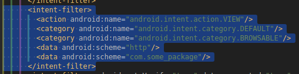

# expo-bug

Good afternoon! I hope you can review and fix this issue. 

When building an android, an incorrect one is generated AndroidManifest.xml config. You can view it in the android/app/src/main folder. It is worth paying attention to the fact that there are two <data> attributes in one intentfilter and the latter overrides all the above options. This affect only android apps deep linking. 

It would be great to split this into 2 intent-filters with different <data> attributes. To verify my statement, you can check any expo android application and use the adb utility: `adb shell am start -W -a android.intent.action.VIEW -d "https://some.domain/profile/123"`.

I have analyzed all possible cases. What is surprising: the application has some.domain as a verified domain, but nevertheless does not respond in any way to any some.domain links with the http/https scheme or any other.

Face with this problem in production after eas build, at check .apk eas build and at locally build android
